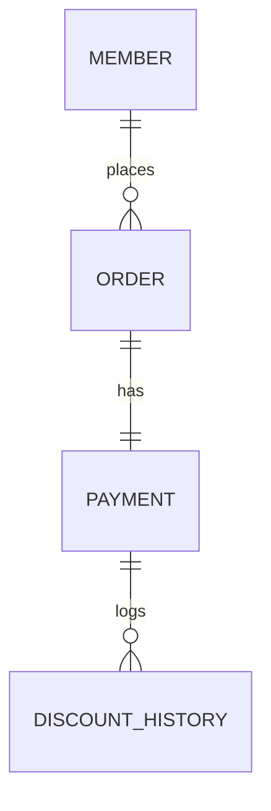

### 설계 고민과 해결 과정

단순한 기능 구현을 넘어, 시스템이 커졌을 때도 유연하게 대응할 수 있는 설계를 목표로 했습니다.
특히, 할인 정책이 수시로 추가 및 변경된다는 점을 주요하게 생각해서 객체지향적으로 설계하려했습니다.

### 1. 정책 주입 방식의 진화 (Config ➡ Router Pattern)
**초기 설계와 문제점:**
처음에는 `DiscountConfig` 설정 클래스에서 `@Bean`을 하나만 등록하여 주입하는 방식을 고려했습니다.
하지만 이 방식은 **"VIP는 고정 할인(1000원), VVIP는 정률 할인(10%)"**과 같이 등급별로 서로 다른 정책 로직이 동시에 공존해야 하는 상황을 처리할 수 없었습니다.

**해결: 라우터(Router) 패턴 도입**
단일 빈 주입 방식을 버리고, **Router 객체**가 회원의 등급을 분석하여 그에 맞는 적절한 `DiscountPolicy` 구현체를 동적으로 배급해 주도록 재설계했습니다.
* **GradeDiscountRouter:** `Member` 정보를 받아 적절한 `DiscountPolicy`를 반환합니다.
* **장점:** 새로운 등급이 추가되어도 비즈니스 로직(`Service`)은 수정할 필요 없이, 정책 클래스 추가 및 라우터 분기만 조정하면 되므로 유지보수가 매우 용이합니다.

### 2. 결제 수단 할인과 확장성 고려 (Router vs List Strategy)
**현황 및 고민:**
결제 수단 할인 또한 일관성을 위해 **PaymentDiscountRouter**를 도입하여 관리하고 있습니다. 이를 통해 결제 수단별 정책이 변경되어도 유연한 대처가 가능합니다.

**향후 리팩토링 계획:**
현재의 라우터 방식은 '결제 수단 1개당 -> 정책 1개'를 매핑하는 구조입니다. 하지만 추후 **"하나의 결제 수단에 여러 할인 정책(이벤트 + 제휴 등)을 중복 적용"**해야 하는 요구사항이 생긴다면 한계가 있을 수 있습니다.
이를 보완하기 위해, 향후에는 등록된 모든 할인 정책(`List<Policy>`)을 순회하며, `isSupport(method)`와 같은 메서드로 체크하여 해당되는 **모든** 정책을 적용하는 방식으로 리팩토링하여 확장성을 높일 수 있습니다.

### 3. if-else를 지양한 OCP(개방-폐쇄 원칙) 준수
**설계 의도:**
처음부터 `Service` 계층에 `if (method == POINT) ... else if (method == CARD)`와 같은 구체적인 분기문을 작성하지 않았습니다.
이러한 분기문은 새로운 결제 수단이 생길 때마다 기존 코드를 수정하게 만들어 **OCP**를 위반하기 때문입니다.
대신 인터페이스와 다형성을 활용하여, 구체적인 정책 구현체가 변경되거나 추가되어도 클라이언트 코드(`Service`)는 전혀 영향을 받지 않도록 설계했습니다.

### 4. Null Safety를 위한 Null Object Pattern
**안정성 확보:**
할인 정책이 적용되지 않는 경우(예: 일반 등급, 할인 없는 카드 결제 등) `null`을 반환하게 되면, 서비스 계층에서 `NullPointerException`이 발생할 위험이 큽니다.
이를 방지하기 위해 **Null Object Pattern**을 적용하여 `NoneDiscountPolicy` 및 `NonePaymentDiscountPolicy`를 구현했습니다.
* 할인 대상이 아닐 경우 "할인액 0원"을 반환하는 안전한 객체를 사용함으로써, 클라이언트 코드에서 불필요한 `null` 체크 로직을 제거하고 시스템의 안정성을 높였습니다.

### 5. 데이터 무결성을 위한 DB 설계 (1:N)
중복 할인(등급 할인 + 결제 수단 할인)이 적용될 경우, 하나의 결제 건에 여러 개의 할인 사유가 발생합니다.
이를 정확히 기록하기 위해 `Payment`와 `DiscountHistory`를 **1:N 관계(`@ManyToOne`)**로 설계하여, 정산 시 할인 내역을 투명하게 추적할 수 있도록 했습니다.

---

## 📊 ERD (Entity Relationship Diagram)
중복 할인 이력을 정확히 관리하기 위해 Payment와 DiscountHistory를 **1:N 관계**로 설계했습니다.



## 📂 Project Structure
도메인 중심으로 패키지를 구성하여 관련 로직(Entity, Repository, Service)의 응집도를 높였습니다.

```text
src/main/java/com/polycube/assignment
├── AssignmentApplication.java
└── domain
    ├── discount
    │   ├── grade               # 등급 할인 정책 (Router & Policies)
    │   │   ├── DiscountPolicy.java
    │   │   ├── FixDiscountPolicy.java
    │   │   ├── RateDiscountPolicy.java
    │   │   └── DiscountPolicyRouter.java
    │   └── payment             # 결제 수단 할인 정책 (Router & Policies)
    │       ├── PaymentDiscountPolicy.java
    │       ├── PointPaymentDiscountPolicy.java
    │       ├── NonePaymentDiscountPolicy.java
    │       └── PaymentDiscountRouter.java
    ├── discounthistory
    │   ├── DiscountHistory.java
    │   └── DiscountHistoryRepository.java
    ├── member
    │   ├── Member.java
    │   ├── Grade.java
    │   └── MemberRepository.java
    ├── order
    │   ├── Order.java
    │   ├── OrderRepository.java
    │   ├── OrderService.java
    │   └── OrderServiceImpl.java
    └── payment
        ├── Payment.java
        ├── PaymentMethod.java
        ├── PaymentRepository.java
        ├── PaymentService.java
        └── PaymentServiceImpl.java
```
